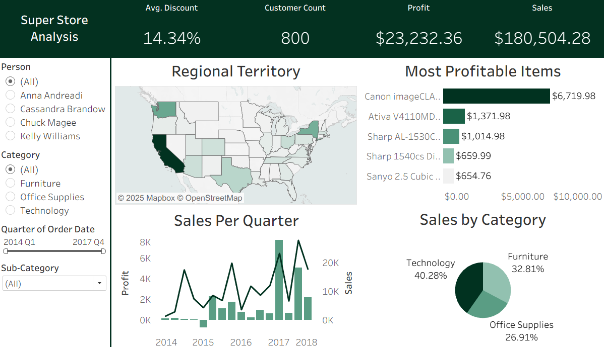

# Superstore Profit & Sales Dashboard

## Overview
This project analyzes a company’s performance over several years using the Superstore dataset. The primary goal is to identify periods of strong and weak performance, enabling stakeholders to make better informed business decisions.

To fully interact with the dashboard, check it out on [Tableau Public!](https://public.tableau.com/app/profile/colby.rood/viz/super_store_analysis_17549266090400/Dashboard1)

## Dataset
The dashboard is built using Tableau’s sample Superstore dataset, which contains fictional sales and profit data for a retail company operating in the United States. The dataset includes:
- Order Details – Order ID, order date, ship date
- Product Information – Category, sub-category, product name
- Sales Metrics – Sales amount, quantity sold, discount applied, profit earned
- Customer Information – Customer name, segment (Consumer, Corporate, Home Office)
- Geographic Data – Country, state, city, postal code, and region

## Features
- Profit & Sales trends over time
- Category and sub-category breakdowns
- Regional performance comparison
- Interactive filtering and drill-downs

## Dashboard Screenshot

